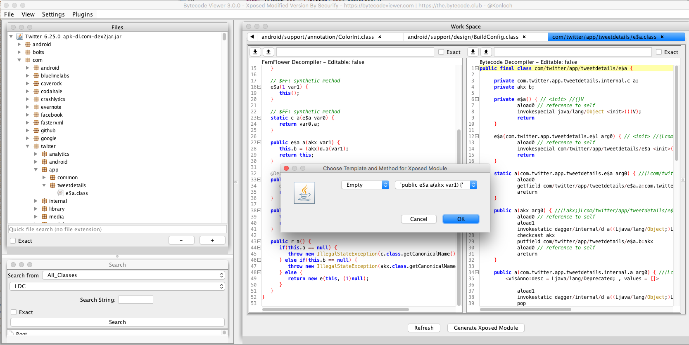

#Bytecodeviewer clean up 

This is clean working version of the Bytecodeviewer program
The latest master version contains issues with the POM and dependencies that does run properly
This version is a fully Java Application without any Maven depencies
Many issues encountered in the Maven dependencies have to do with libraries not being suported by Maven distribution

